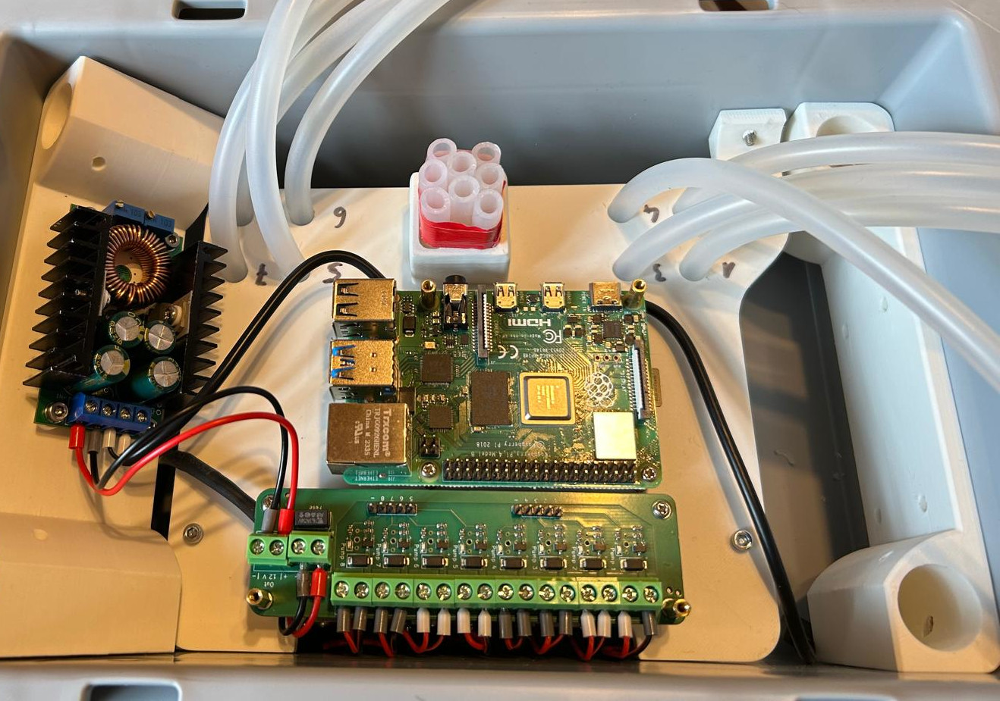

# Assembly

Step-by-step assembly of the CocktailBerry 2-Go.

--8<-- "machine/image_support.md"

## Step 1 - Drill Holes in Casing

The casing needs some holes for the parts to be mounted inside.
There is no exact measurement for the holes, the parts should be placed and then the hole position marked and drilled.
Drill two 4 mm holes on each short side for the leg holders.
Drill two 4 mm holes on the back side and one 3 mm hole on the front side for the pump grid combined with the electric lid (this can be done after the pump grid is mounted).
If a monitor is used, cut a rectangular opening and drill the 2.5 mm monitor holes in the front.
Drill a hole on the back side for the power jack (12 V), at the side where the converter will be placed.

## Step 2 - Mount the Pumps

Put all 8 pumps in the pump grid, power connection facing to the extensions with the M4 threads.
Use the M2.5 grub screws to fix the pumps in the grid.
Both of the power supply connections should be parallel to the long side of the grid.

## Step 3 - Mount the Main Board

The main board is mounted on the top of the pump grid with two M3 screws.
The long part should point in the direction of the pump outlet.

## Step 4 - Connect the Tubing

The pumps in the grid are placed in a "zig-zag" pattern, so the tubing can be connected in a way that the tubes do not cross each other.
Use the first 4 pumps to connect to the left side, the second 4 to connect to the right side of the numbered inlets.
The tubing should be long enough to reach the bottom of the bottle when the machine is assembled, keep it a little bit longer than needed.
Try to match each numbered inlet to the inlet of the corresponding pump.
Connect the outlet tubes to the pump outlets.
You can use some tape to fix all tubes together at the machine outlet, so they can't slip back.

## Step 5 - Mount the PCBAs + SBC

Mount 8 hex standoffs (M2.5) on the main board, forming two rectangles, one for the CocktailBerry Slim board and one for the Raspberry Pi.
Mount the CocktailBerry Slim board on the main board, screw only two inner corners.
Do the same with the Raspberry Pi, mount it on the main board with 4 hex standoffs (M2.5) and screw only two inner corners.
Mount the converter onto the leg holder with the threaded inserts.

## Step 6 - Connect the Pumps

Solder the pump wires to the CocktailBerry Slim board, red to + and black to -.
Connect the GPIO pins of the Raspberry Pi to the CocktailBerry Slim board with jumper wires.

--8<-- "machine/gpio_pins.md"

## Step 7 - Connect the Power

Connect the power jack to the 12 V input of the CocktailBerry Slim board.
The 12 V output of the board should be connected to the input of the voltage converter, and the 5 V output of the converter should be connected to the Raspberry Pi.
Keep the wires long enough that they can be routed inside the casing, once mounted.

## Step 8 - Assemble the Casing

Mount the pump grid + main board combination into the casing, also both sides of the leg holders.
Use the matching screws from the outside of the casing to fix the parts in place.
Fix the power jack into the casing, so it doesn't move.
*Optional*: Connect the HDMI and USB cables from the touchscreen to the Raspberry Pi.
Use the M2.5 screws to fix the touchscreen to the casing, if a touchscreen is used.
Put the electric lid on the casing and fix it with the M2.5 screws.
The funnel can be attached to the main board, fixed with one M2.5 screw, so it doesn't move.
It can be removed the same way for transportation or cleaning.

<figure markdown>
  
  <figcaption>Mounting inside the casing (no screen)</figcaption>
</figure>

## Step 9 - Installation of Software

--8<-- "machine/software_install.md"

--8<-- "machine/final_checks.md"
