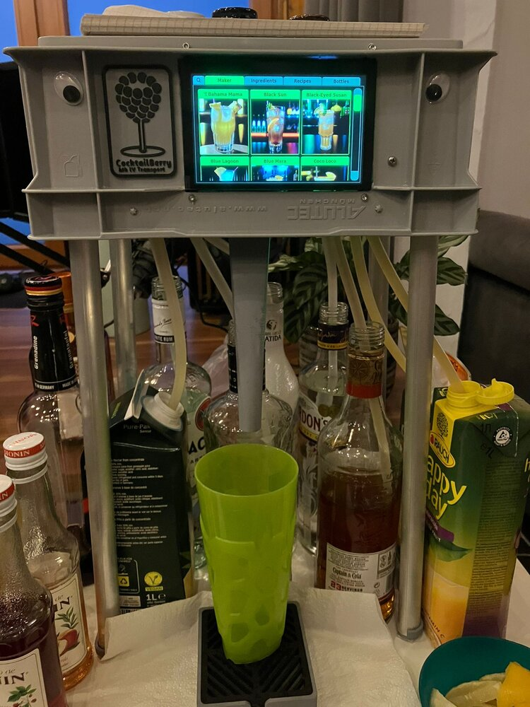

# CocktailBerry 2-Go

The **CocktailBerry 2-Go** is a portable, compact CocktailBerry machine.
It might not be the prettiest, but it is designed to be easily built and used on the go.
It uses a Euro Box enclosure and 3D-printed parts to hold everything together, and it can be powered by a 12 V battery pack for true portability.
You can also use a normal 12 V power supply if you don't need to take it on the road.
The legs can be detached for easier transport, and the whole thing can be stored in a backpack or small case.

--8<-- "machine/released.md"

<figure markdown>
  
  <figcaption>Front view of the machine with touchscreen</figcaption>
</figure>

## Specifications

| Property   | Value                                            |
| ---------- | ------------------------------------------------ |
| Dispensers | 8 × membrane pumps                               |
| Display    | 5" integrated LCD touchscreen or smartphone      |
| Controller | Raspberry Pi 3 Model B+ (newer models also work) |
| Power      | 12 V input; internal transformer powers the Pi   |
| Software   | CocktailBerry v1  or v2 (no touchscreen)         |
| Enclosure  | Euro Box, 3D-printed parts inside                |
| Dimensions | 30×20×12 cm (box), ~50 cm high with legs         |

## Downloads

The printable and CAD files are attached to each [release]({{extra.repo_url}}/releases) as a single
archive:

- **3D files:**
  [`2go.zip`]({{extra.repo_url}}/releases/latest/download/2go.zip)
  - STL (print-ready) and STEP (CAD) for every part.

## Build Guide

1. [Needed Parts](needed-parts.md) - what to print, buy, and have ready.
2. [Preparation](preparation.md) - printing, post-processing, and prep work.
3. [Assembly](assembly.md) - putting it all together.
