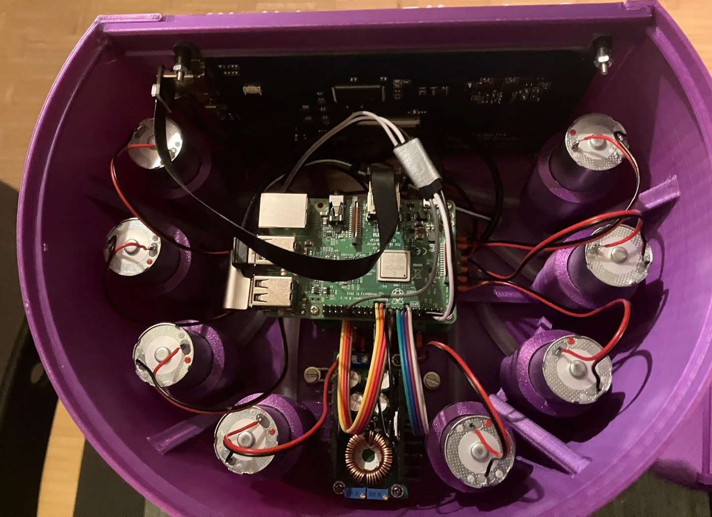

# Assembly

Step-by-step assembly of the CocktailBerry MK III.

--8<-- "machine/image_support.md"

## Step 1 - Prepare the Base Plate

You need to drill one 5 (+0.1) mm hole into the center of the base plate and one 15 mm away from the center, toward the back of the plate.

## Step 2 - Assemble the Tower

Solder wires to the power jack; they need to be long enough to reach from the jack hole in the back of the middle tower up into the top tower.
Mount the jack into the middle tower, put the wires through the top hole into the tower.

Start by screwing the Tower Bottom to the base plate using the M5 insert and an M5 screw.
Then stack the Tower Middle and screw it to the bottom part using M3 screws.
Put the Tower Top on and screw it to the middle part using M4 screws.
Insert the Bundler from the top into the top tower using its profile and glue it in place.

## Step 3 - Mount the Pumps

Cut the tubing for the pump inlet, it should be a little longer than the distance from the base plate to the top of the pump socket.
Connect the pump with the tubing, insert the tubing into one pump socket.
Push another tube through the outlet and connect it to the pump.
Place the pump into the socket, guide the outlet tube through the bundler.
Cut the outlet tube, leaving some distance to the end of the bundler.
Repeat this for all pumps, try to route each outlet tube to its position in the bundler, so they don't cross each other.

When the tubes do not lay snugly, you can use the optional pump fixer to fix them in place, parallel to the bottom of the tower.
You can use some tape to fix all tubes together at the machine outlet, so they can't slip back.
Put the funnel to the bundler and use one screw to fix it in place, so it doesn't move.

## Step 4 - Mount Electronics

Mount the CocktailBerry Board on the top tower (middle) using M2.5 hex standoffs.
Use as much distance as you need to not collide with the tubes.
Fix the board with more M2.5 standoffs on the top, so it doesn't move.
Do not use screws, since we add the Raspberry Pi on top of the board later.
Do the same with the converter on the inner back side of the tower.

## Step 5 - Solder the Pumps

If the pumps do not come with wires attached, solder them on; otherwise skip this step.
Make sure the wire from each pump is long enough to reach the board, and solder the wires to the corresponding pump socket on the board.

## Step 6 - Wiring of Electronics

For all the screw terminals, you can use the crimp connectors to make the wire connection easier and more secure, but this is an optional step.

The Power Jack needs to be connected to the 12 V input of the CocktailBerry Board.
The 12 V output of the board should be connected to the input of the voltage converter, and the 5 V output of the converter should be connected to the Raspberry Pi.
Connect each pump to a matching +/- pump output on the CocktailBerry Board.
For easier setup, try to connect the pumps in order (for example, pump 1 to the first pump socket, pump 2 to the second, etc.).

## Step 7 - Mount the Touchscreen

Mount the touchscreen on the monitor bridge using the screws and nuts.
Glue the monitor bridge to the top of the tower, make sure to align it properly so the screen is centered and straight.
You can use the bottom screws for the monitor to achieve this.

## Step 8 - Mount the RPi

Mount the Raspberry Pi on top of the CocktailBerry Board using the M2.5 hex standoffs and screws.
If the standoffs are too short, stack a second one on top.
You can also already go with step 9 here (GPIO connections) and then mount the RPi, since the GPIO connections are easier to access without the RPi in place.

## Step 9 - Connect Signals

Connect the GPIO pins with the GND and pump 1-8 pins of the board using jumper wires.

--8<-- "machine/gpio_pins.md"

Connect the HDMI and USB cables from the touchscreen to the Raspberry Pi.

<figure markdown>
  
  <figcaption>Top view inside the machine</figcaption>
</figure>

## Step 10 - Installation of Software

--8<-- "machine/software_install.md"

--8<-- "machine/final_checks.md"
