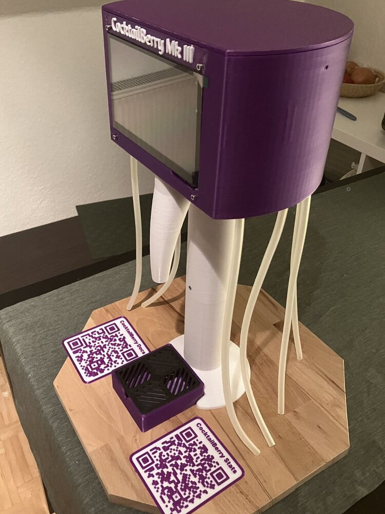

# CocktailBerry MK III

The **MK III** is the successor to the MK II and the reference build for the CocktailBerry **v1** software; the [MK IV](../mk4/index.md) is the reference build for **v2**.
By moving the wiring onto the [CocktailBerryBoard](../../pcbas/cocktailberry-board-gpio.md), it achieves a noticeably smaller footprint while keeping the full feature set of its predecessor.

It is fully 3D-printed and designed to be produced on a common **250 × 250 mm** print bed.

--8<-- "machine/released.md"

<figure markdown>
  
  <figcaption>Side view of the machine</figcaption>
</figure>

## Specifications

| Property   | Value                                            |
| ---------- | ------------------------------------------------ |
| Dispensers | 8 × membrane pumps                               |
| Display    | 7" integrated LCD touchscreen                    |
| Controller | Raspberry Pi 3 Model B+ (newer models also work) |
| Power      | 12 V input; internal transformer powers the Pi   |
| Software   | CocktailBerry v1 (Qt); also runs v2              |
| Enclosure  | Fully 3D-printed (fits a 250 × 250 bed)          |
| Dimensions | ⌀ ~240 mm × ~550 mm (H)                          |

Because the touchscreen is built in, the **v1** app is the natural fit, but the machine can also be run with **v2**.

!!! note "Base build"
    The MK III documented here is the base machine. Optional CocktailBerry
    capabilities - WS281x LEDs, RFID/NFC payment, scale/weight sensing, and
    carriages - are **not** part of this build.

## Downloads

The printable and CAD files are attached to each [release]({{extra.repo_url}}/releases) as a single archive:

- **3D files:**
  [`mk3.zip`]({{extra.repo_url}}/releases/latest/download/mk3.zip)
  - STL (print-ready) and STEP (CAD) for every part.

## Build Guide

1. [Needed Parts](needed-parts.md) - what to print, buy, and have ready.
2. [Preparation](preparation.md) - printing, post-processing, and prep work.
3. [Assembly](assembly.md) - putting it all together.
