# Assembly

Step-by-step assembly of the CocktailBerry MK IV.

--8<-- "machine/image_support.md"

## Step 1 - Prepare the Base Plate

You need to drill two 5 (+0.1) mm holes along a line through the center of the base plate.
If you use a scale, you need to drill two additional 5 (+0.1) mm holes for the scale mounting.
Drill a chamfer for the countersunk heads into the holes.

<figure markdown>
  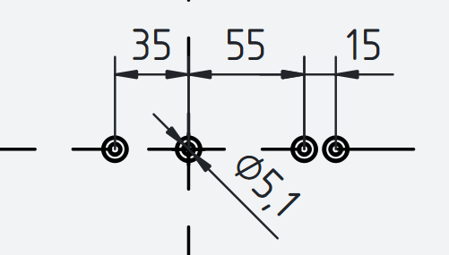
  <figcaption>Position of plate holes, right ones are optional</figcaption>
</figure>

## Step 2 - Assemble the Tower

Solder wires to the power jack; they need to be long enough to reach from the jack hole in the back of the middle tower up into the top tower.
Mount the jack into the middle tower, put the wires through the top hole into the tower.

Start by screwing the Tower Bottom to the base plate using the two M5 inserts and M5 screws.
If using a scale, see [scale wiring](#optional-scale-wiring) and for LEDs see [LED wiring](#optional-led-wiring).

Stack the middle tower onto the bottom part and screw it to the bottom part using M3 screws.
If there are cables coming from the bottom tower, make sure to guide them through the middle tower.
Put the Tower Top on and screw it to the middle part using M4 screws.
Also guide all cables through the top tower, so they can be connected to the board later.
Insert the Bundler from the top into the top tower using its profile and glue it in place (*optional*, can also just friction fit).

## Step 3 - Mount the Pumps

Cut the tubing for the pump inlet, it should be a little longer than the distance from the base plate to the top of the pump socket.
As an alternative, you can use both ends of the tubing and cut it later after each pump is placed.
This requires one long (5-10 m) piece of tubing, which is usually what you buy anyway.

### Membrane Pumps

The membrane pumps use the 5×8 mm tubing and are mounted into the kidney-shaped pump sockets.
Connect the pump with the tubing, insert the tubing into one pump socket.
Push another tube from the middle tower through the bundler and the outlet, connect it to the pump.

<figure markdown>
  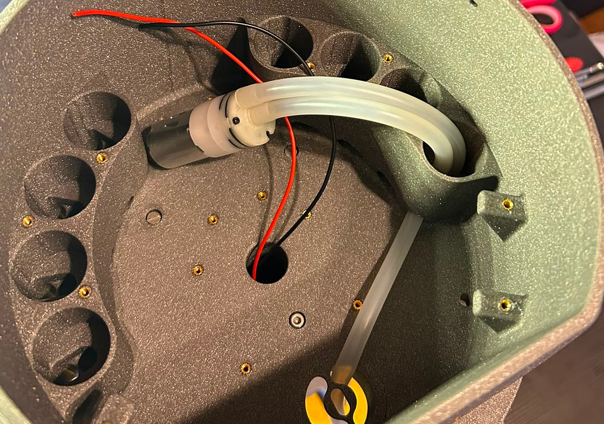
  <figcaption>Single membrane pump</figcaption>
</figure>

Place the pump into the socket, gently pull the tubing to ensure it is secure.
Cut the outlet tube, leaving some distance to the end of the outlet (~5 cm).
Repeat this for all membrane pumps, try to route each outlet tube to its position in the bundler, so they don't cross each other.

<figure markdown>
  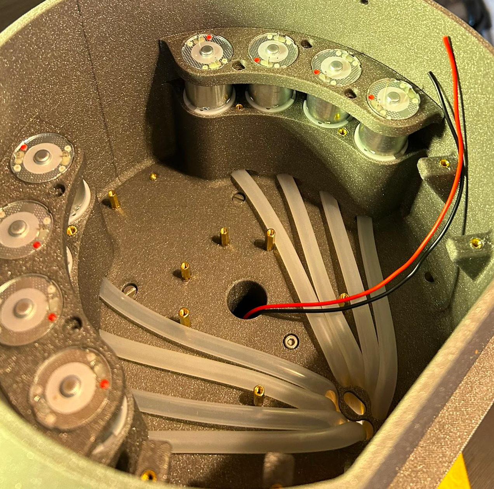
  <figcaption>Membrane pump assembly, top view</figcaption>
</figure>

When the tubes do not lay snugly, you can use the optional tube fixer to fix them in place, parallel to the bottom of the tower (should only concern membrane pumps).

<figure markdown>
  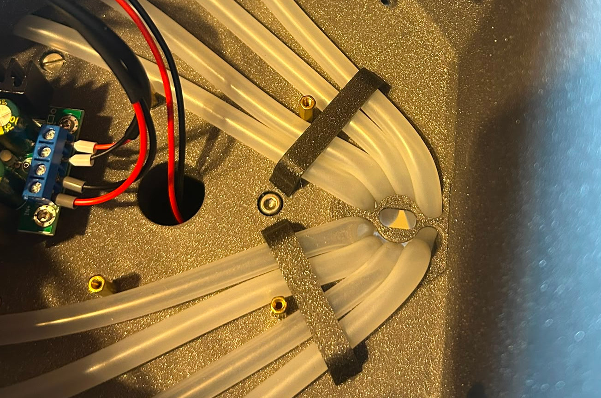
  <figcaption>Tube fixer, top view</figcaption>
</figure>

### Peristaltic Pumps

The peristaltic pumps use the 3×5 mm tubing and are mounted into the elevated pump holders in the front.
First, screw the peristaltic pump into the pump holder using the M2.5 screws.
The tubing should point away from the top of the U-shape.

<figure markdown>
  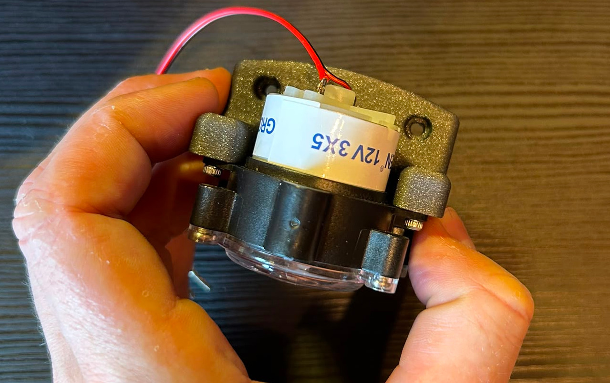
  <figcaption>Peristaltic pump assembly, top view</figcaption>
</figure>

It is strongly recommended to solder the wires to the pump before mounting it into the tower.
Then proceed to connect the input and output tubing as described for the membrane pumps.
Mount the pump holder into the tower using the M3 screws.

### Wrap-Up

You can use some tape to fix all tubes together at the machine outlet, so they can't slip back.
Then you can cut the outlet tubes short and in identical length, so they do not block the funnel.

<figure markdown>
  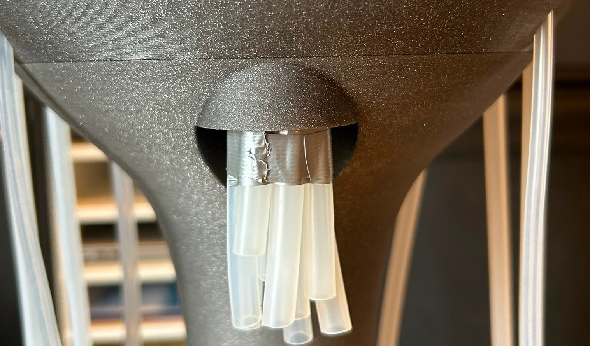
  <figcaption>Outlet tubes bundled, top view</figcaption>
</figure>

Push the funnel to the bundler until the magnet holds.
Fix the membrane pumps with the pump tower lid (see figure "*Membrane pump assembly, top view*"), which is screwed to the top of the tower using M3 screws.

<figure markdown>
  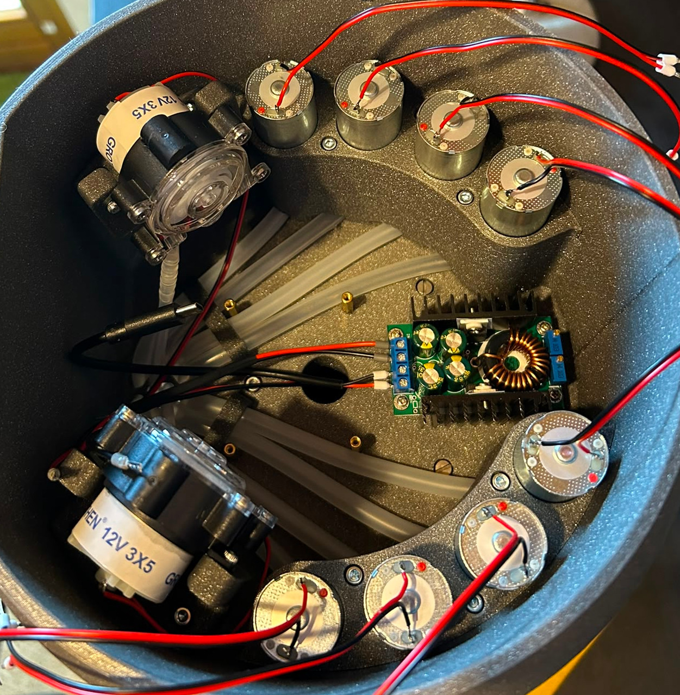
  <figcaption>Pump assembly complete, top view</figcaption>
</figure>

## Step 4 - Mount Electronics

Mount the voltage converter in the back between the pumps using M2.5 hex standoffs and screws.
You can use shorter standoffs for the converter and longer for the CocktailBerry Board, so the converter is lower than the board.
You can already connect the Raspberry Pi power cable, as well as one cable long enough to reach the CocktailBerry Board power output.
This is easier to do now, while the tower is still mostly empty.

<figure markdown>
  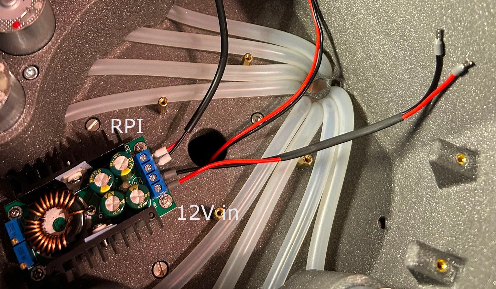
  <figcaption>Converter connection, top view</figcaption>
</figure>

Mount the CocktailBerry Board on the top tower (middle) using M2.5 hex standoffs.
Use as much distance as needed to not collide with the tubes.
Fix the board with more M2.5 standoffs on the top, so it doesn't move.
Do not use screws, since we add the Raspberry Pi on top of the board later.

## Step 5 - Solder the Pumps

If the pumps do not come with wires attached, solder them on; otherwise skip this step.
Make sure the wire from each pump is long enough to reach the board, and solder the wires to the corresponding pump socket on the board.
For peristaltic pumps, the polarity matters, so make sure to solder it so the pump runs in the outlet direction of the tubing.

## Step 6 - Wiring of Electronics

For all the screw terminals, you can use the crimp connectors to make the wire connection easier and more secure, but this is an optional step.

The Power Jack needs to be connected to the 12 V input of the CocktailBerry Board.
The 12 V output of the board should be connected to the input of the voltage converter, and the 5 V output of the converter should be connected to the Raspberry Pi.
Connect each pump to a matching +/- pump output on the CocktailBerry Board.
For easier setup, try to connect the pumps in order (for example, pump 1 to the first pump socket, pump 2 to the second, etc.).
It is recommended to first connect everything to the CocktailBerry Board before mounting it into the tower, since it is easier to access the screw terminals without the tower in the way.

If you use a scale, connect it either to the I2C of the CocktailBerry Board or to the GPIO of the Raspberry Pi (next step), depending on which board you have.

## Step 7 - Mount the RPi

Mount the Raspberry Pi on top of the CocktailBerry Board using the M2.5 hex standoffs and screws.
If the standoffs are too short, stack a second one on top.
You can also already go with step 8 here (CocktailBerry Board connections) and then mount the RPi, since the GPIO connections are easier to access without the RPi in place.

## Step 8 - Connect Signals

If you use the I2C version of the CocktailBerry Board, just connect the I2C (3V3, GND, SDA, SCL) of the Raspberry Pi to the I2C of the CocktailBerry Board.

Otherwise, connect the GPIO pins with the GND and pump 1-10 pins of the board using jumper wires.

--8<-- "machine/gpio_pins.md"

If you have an LED, connect it to the GND, 5 V and GPIO (10 preferred) of the Raspberry Pi.

<figure markdown>
  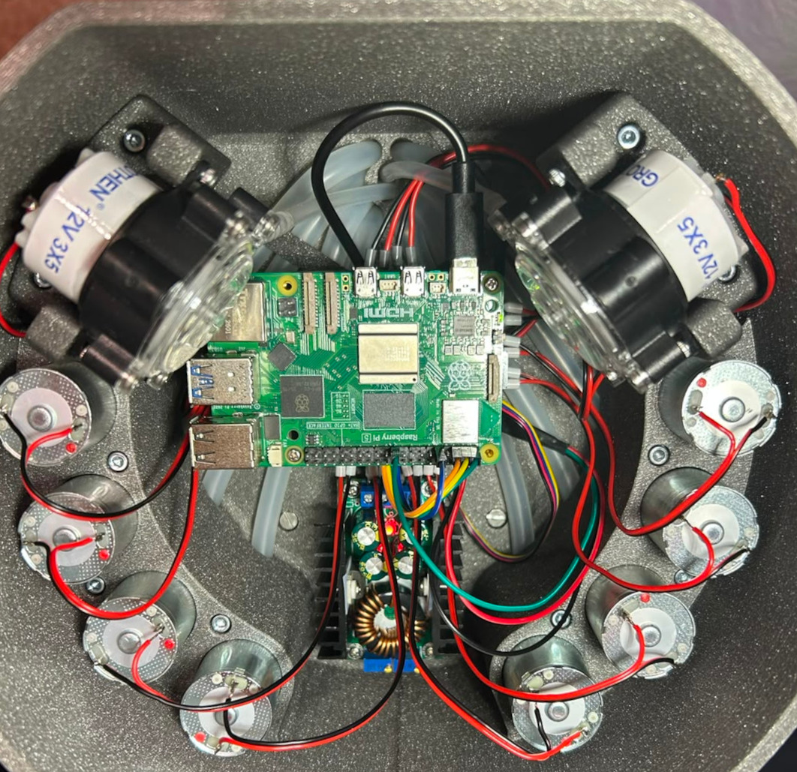
  <figcaption>Inner finished, top view</figcaption>
</figure>

## Step 9 - Glue the Plate

Apply some glue to the front of the top tower to fix the tablet holder plate in place.
It should be symmetrically aligned with the tower, so the tablet can be placed in the middle of the tower.
You can let it overlap as much as you want on the top, 5 mm are recommended, but it is not critical.

<figure markdown>
  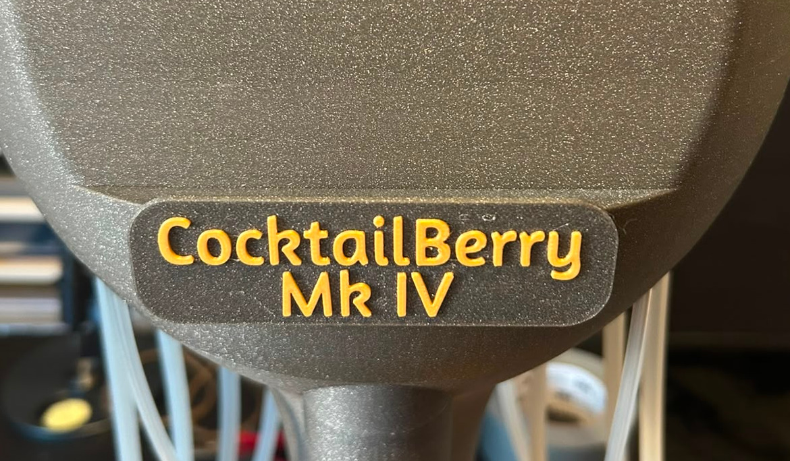
  <figcaption>Tablet holder plate, front view</figcaption>
</figure>

## Step 10 - Installation of Software

--8<-- "machine/software_install.md"

## Step 11 - Finalization

Now you can put the tower lid on top of the tower and screw it in place using M3 screws.
Put the drip tray with the draining rack in the corresponding cutout at the bottom tower.
Place a bottle to each slot and adjust the length of the inlet tubing to reach the bottom of the bottles.
The machine is now ready to be connected to the power supply and can be used.

## *Optional* Scale Wiring

The load cell is screwed into the plate with two M5 screws, with the bottom holder in between.
The cable of the scale needs to point to the center of the plate/tower.
Then screw the top connector onto the load cell using two M4 screws.
The cable of the load cell needs to be pushed through the hole in the bottom tower.
Most load cells will not have a long enough cable, so you need to solder an extension there.
It should be long enough to reach out of the bottom tower.

<figure markdown>
  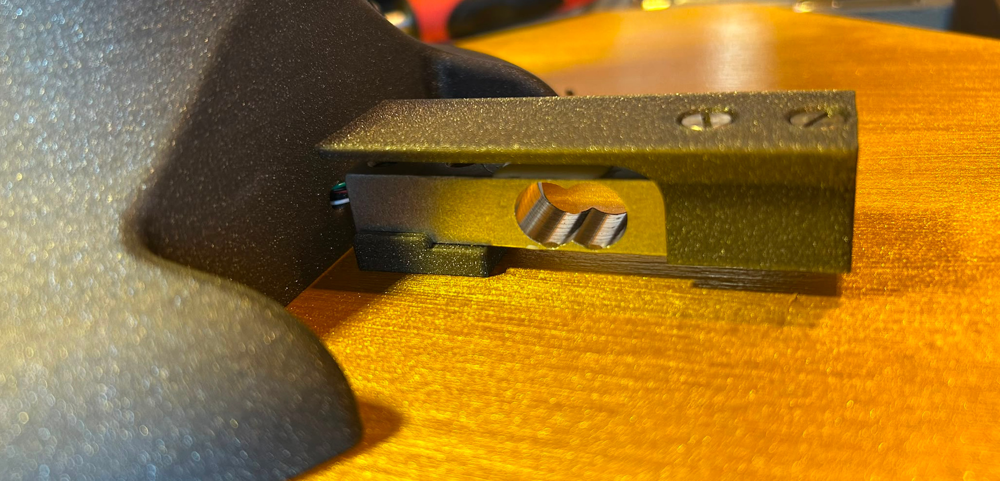
  <figcaption>Scale assembly, bottom view</figcaption>
</figure>

Screw the scale board onto the scale electronics socket using the M2.5 screws and slide it into the fitting socket in the tower.
Connect the load cell to the scale board (Red: E+, Black: E-, White: A-, Green: A+), and attach the connection cable for the CocktailBerry Board/Raspberry Pi now.
It will be guided through the tower to the top later, so it can be connected to the board.

<figure markdown>
  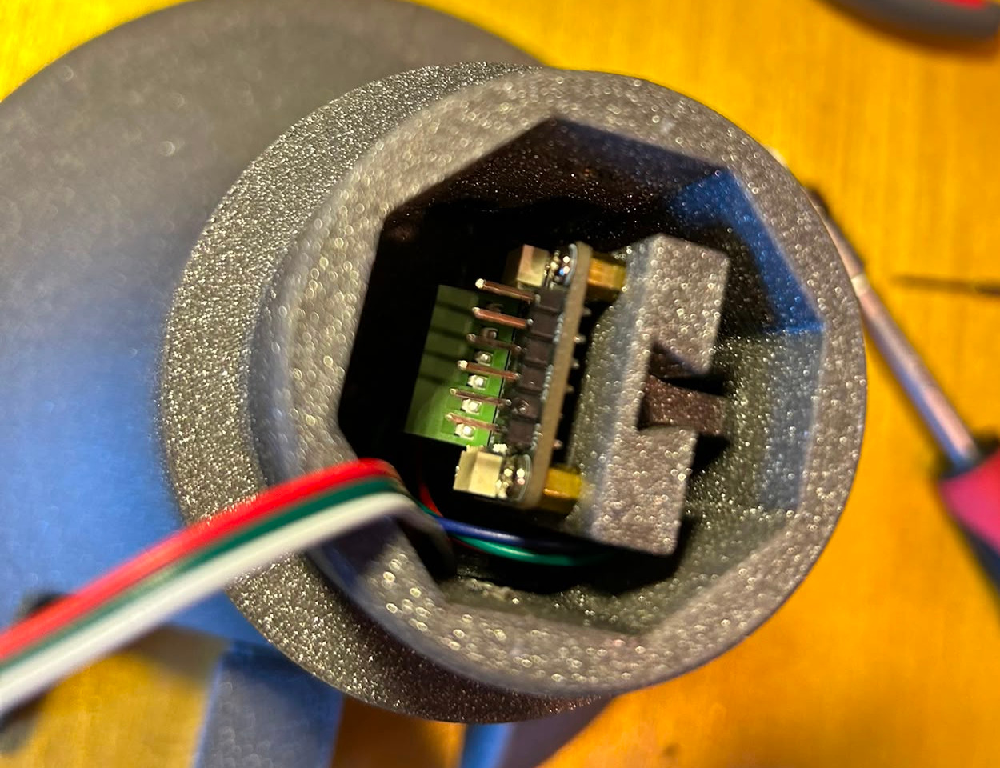
  <figcaption>Electrics in tower</figcaption>
</figure>

## *Optional* LED Wiring

It is recommended not to solder the LED before pushing the cable through the tower, since it is a tight fit.
Push the LED cable through the tower, and solder it to the LED strip.
Place the LED into the socket in the tower, touching the bottom of the cutout.
Put the LED hole plug into the tower, hiding the hole for the cable.
I recommend using a connector cable for the LED, so you can disconnect the LED from the middle point of the tower, when you need to disassemble the tower later.
Otherwise you can also use a long enough cable to the top of the tower.
In each case, attach the mating connector now.
It can be guided through the tower to the top, so it can be connected to the board later.

<figure markdown>
  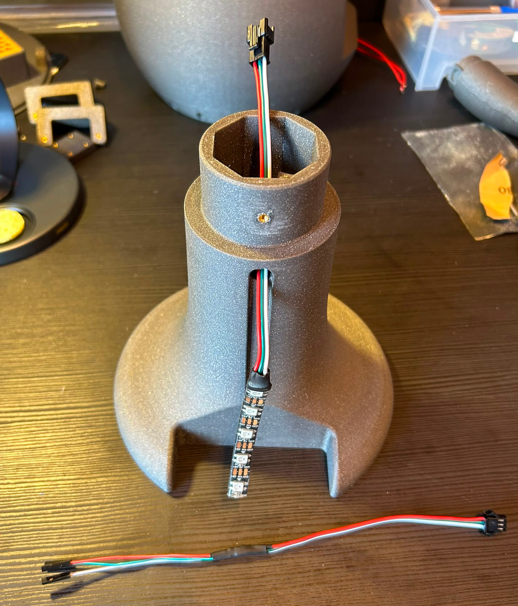
  <figcaption>LED assembly, bottom view</figcaption>
</figure>

--8<-- "machine/final_checks.md"
