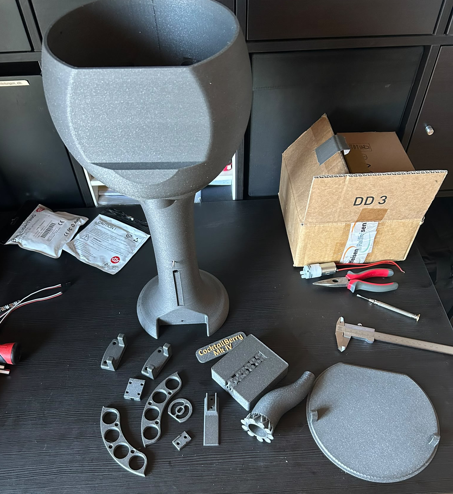
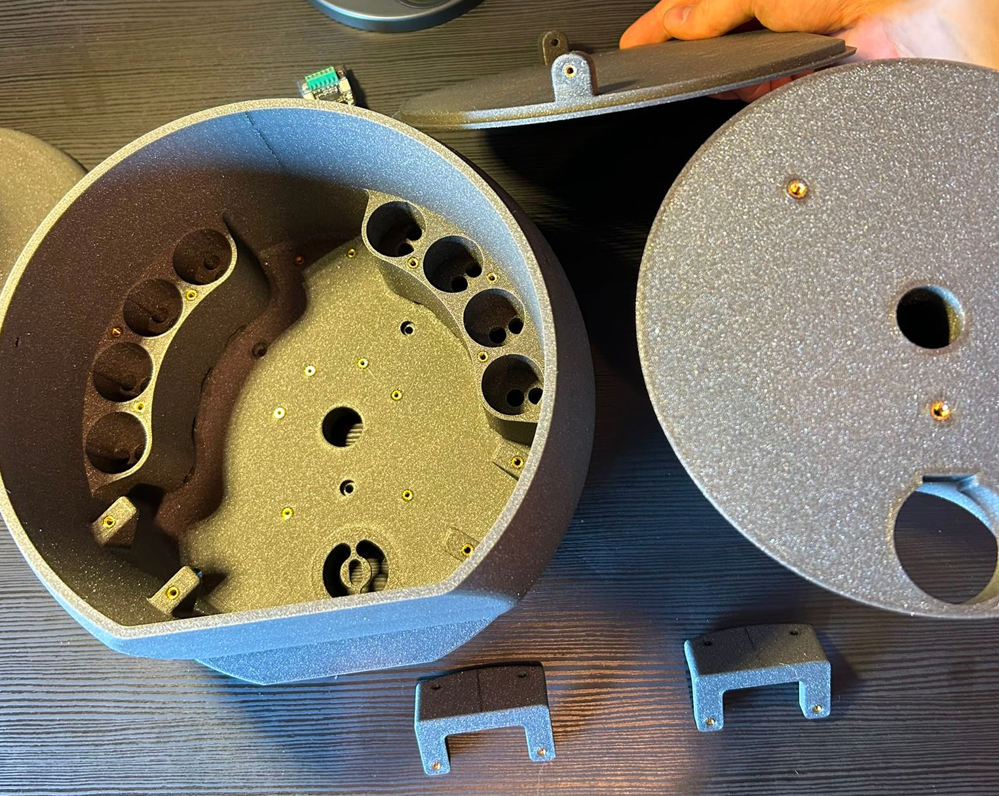

# Preparation

Steps to complete before assembly.

--8<-- "machine/preparation.md"

<figure markdown>
  
  <figcaption>All parts of the CocktailBerry MK IV</figcaption>
</figure>

## Step A - Solder Inserts

First, solder the threaded inserts into the printed parts that require them.
Here is an overview of which insert goes where:

- Lid Tower: two M3 on the pads
- Tower Bottom: two M3 on the top connecting point, two M5 on the bottom
- Tower Middle: three M4 on the top connecting point
- Tower Top: eight M2.5 on the electric mounting points, three M3 each side on the pump sockets, two M3 each side on the peristaltic holders (front)
- Peristaltic holder: two M2.5 on the mounting points in the U-shape for each part
- Optional Scale: four M2.5 into the scale electrics socket

<figure markdown>
  
  <figcaption>All parts of the CocktailBerry MK IV with inserts soldered</figcaption>
</figure>

## Step B - Insert Magnets

Put the magnets into the slots of the funnel and the bundler, so they can hold together.
