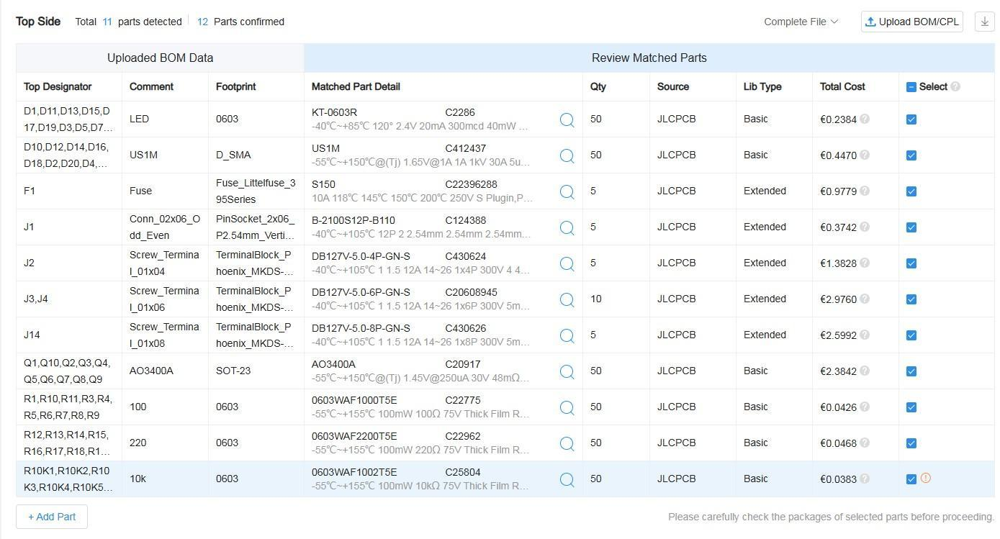
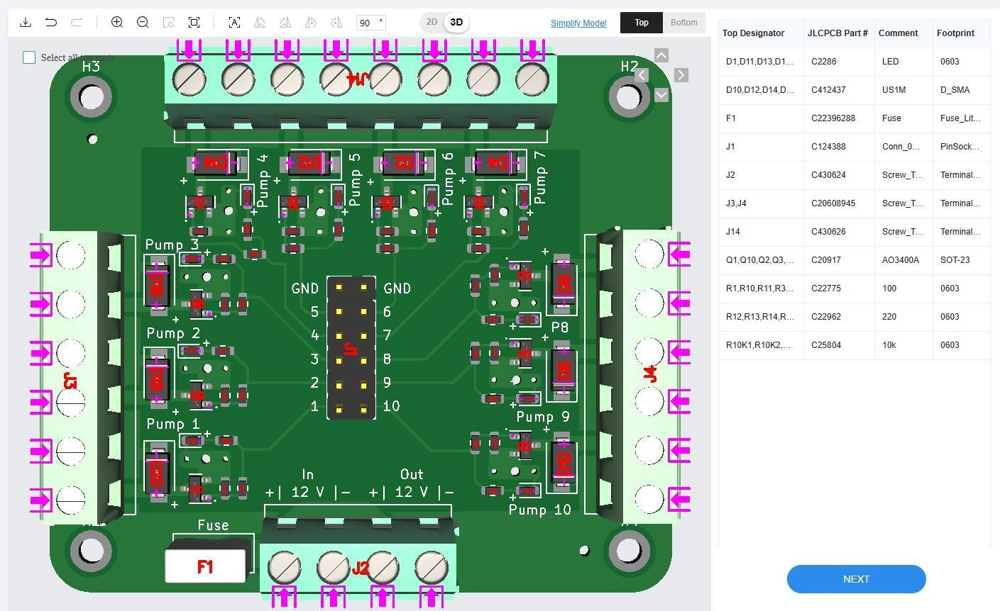

# Ordering at JLCPCB

Every CocktailBerryBoard ships as a ready-to-order fabrication package, so JLCPCB can manufacture **and** assemble the board for you - no soldering needed.
This page walks through one order, from upload to checkout.

## Before you start

Download the fabrication package for your board.
Every [PCBA page](index.md) links it under **Files**, and all packages are attached to each [release]({{extra.repo_url}}/releases).

Unpack it - the three files inside are everything the order needs:

| File          | Purpose                                            |
| ------------- | -------------------------------------------------- |
| `gerbers.zip` | The board itself (copper, mask, silkscreen, drill) |
| `bom.csv`     | The parts, with their LCSC part numbers            |
| `pos.csv`     | Where each part goes (pick-and-place)              |

## Board

1. Open the [JLCPCB quote page](https://jlcpcb.com/quote) and upload `gerbers.zip`.
2. Adjust the board options to taste - colour, lead-free and the like are yours to pick, the defaults work fine.
3. Switch **PCB Assembly** on and set **Tooling holes** to *Added by Customer*, then continue.
4. Check the rendered board preview, then continue.

## Parts

1. Upload `bom.csv` as the BOM and `pos.csv` as the pick-and-place file.
2. Process the BOM and walk through the matched parts. Most come back matched and preselected; where one does not, pick the proposed part and tick its checkbox.

!!! note "`H1`-`H4` are expected to be missing"

    The four mounting holes carry no part, so they are absent from the pick-and-place file and JLCPCB flags them. That warning is fine. Any **other** designator showing up there is not - stop and check your files.

<figure markdown>
  
  <figcaption>All parts matched and selected (example: CocktailBerryBoard GPIO)</figcaption>
</figure>

## Placement

Continue to the placement preview and check it: every part in its footprint, polarity markers where you expect them.

<figure markdown>
  
  <figcaption>Correct part placement (example: CocktailBerryBoard GPIO)</figcaption>
</figure>

## Order

Continue to the quote, review it, and save the order to your cart.
Then check out - it pays to look for a coupon code before you do.
